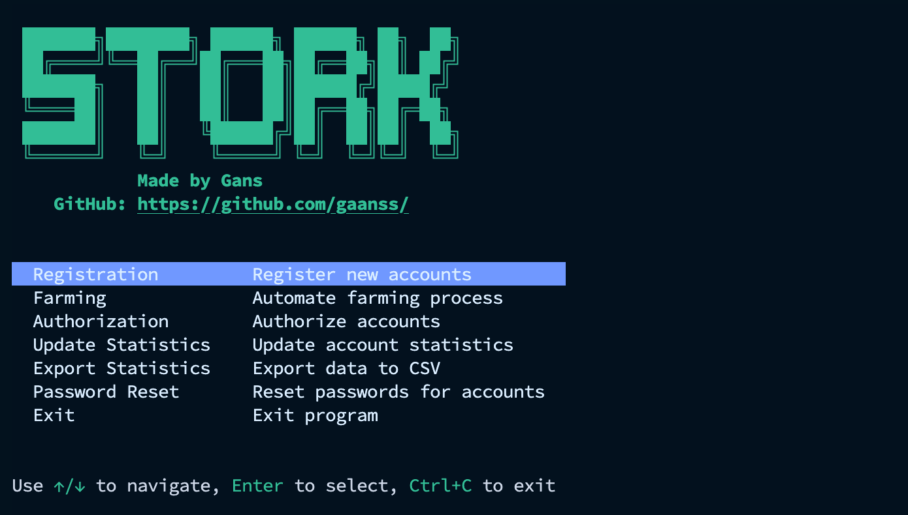

# Stork 🚀


> **Note:** This is paid software. 
> To purchase, contact via Telegram: [@gaansss](https://t.me/gaansss)

Stork is an automation tool for managing accounts registration and farming on the Stork platform.



## Features ✨

- 🔐 Secure account authentication via AWS Cognito
- 👤 Automated account registration with referral code support
- 🤖 Account farming with rotation and multiple concurrent sessions
- 📊 Statistics tracking and export functionality
- 🔄 Multi-threaded processing
- 🌐 Proxy support with rotation on errors
- 📝 Comprehensive logging system

## Requirements 📋

- Python 3.11+ 🐍
- PostgreSQL database
- Windows or Linux operating system

## Installation 🔧

1. Clone the repository:
   ```bash
   git clone <repository-url>
   cd stork
   ```

## Configuration ⚙️

Main settings in the `settings.yaml` file:

```yaml
# Database configuration
database:
  host: your_database_host
  port: 5432
  name: your_database_name
  user: your_database_user
  password: your_database_password

# Farming configuration
farming:
  concurrent_accounts: 10 # Number of accounts to farm simultaneously
  rotation_hours: 24 # Time interval in hours between account rotations in the farming queue
  delay_between_accounts: 5 # Delay in seconds between each account start during initialization

# Registration configuration
registration:
  concurrent_registrations: 10 # Number of parallel registration processes
  referral:
    mode: "random"
    static_code: "your_referral_code"
```

### Data Files Format

1. `data/registration.txt` - list of accounts for registration:
   ```
   email:password:imappassword
   email:password:imappassword
   ```
   Where:
   - `email` - email address for registration
   - `password` - password for Stork account
   - `imappassword` - password for email IMAP access (can be different from account password)

2. `data/farming.txt` - list of accounts for farming:
   ```
   username:password
   username:password
   ```

3. `data/proxy.txt` - list of proxies (one per line):
   ```
   username:password@host:port
   username:password@host:port
   ```

## License System 🔑

The application uses a license system to authenticate users:

1. When you run the application for the first time, you will be prompted to enter your license key
2. The license key will be verified with the license server
3. After successful verification, your license key will be saved in the `config.json` file

If you don't have a license key, please contact the developer.

## Usage 🖥️

### Running the Executable

#### Windows:
1. Run `stork.exe` by double-clicking it or from command line:
   ```
   stork.exe
   ```

#### Linux:
1. Make sure the file has execution permissions:
   ```bash
   chmod +x stork
   ```
2. Run the program:
   ```bash
   ./stork
   ```

## Main Operations 📝

- **Account Registration** - Register new accounts on the Stork platform
- **Account Farming** - Run farming operations with multiple accounts
- **Update Statistics** - Update account statistics in the database
- **Export Statistics** - Export account statistics to CSV file
- **Account Management** - Manage accounts in the application

### Email Requirements ⚠️

For account registration, you need access to the email accounts for verification. The application supports different IMAP modes:

- **Standard Mode**: Each account uses its own email access
- **Single Mode**: One email account is used for all verifications
- **Redirect Mode**: All verification emails are forwarded to a single account

The application now supports separate IMAP passwords for email verification. This is useful when:
- Your email account uses an app-specific password for IMAP access
- You have different passwords for email and Stork accounts
- You use 2FA for your email account and need an application password

Configure the IMAP settings in `settings.yaml` under the `email` section.

### Proxy Support 🌐

The application supports using proxies to avoid IP-based rate limiting. Configure proxy settings in `settings.yaml`:

- Enable/disable proxy usage
- Automatic proxy rotation on WAF detection
- Automatic proxy rotation on connection errors

Add your proxies to `data/proxy.txt` in the format:
```
username:password@host:port
```

## Database Integration 🗄️

The application uses PostgreSQL database to store:
- Account information
- Farming statistics
- Referral codes

Configure database connection in `settings.yaml` under the `database` section.

### Free Neon Database Option

You can use a free [Neon](https://neon.tech) PostgreSQL database for this application:

1. Create a free account at [neon.tech](https://neon.tech)
2. Create a new project
3. Get your connection details from the dashboard
4. Update your `settings.yaml` with these credentials:
   ```yaml
   database:
     host: your-neon-hostname.neon.tech
     port: 5432
     name: your_database_name
     user: your_username
     password: your_password
     ssl_mode: require
   ```

Neon provides a generous free tier with:
- Unlimited PostgreSQL databases
- 3 GiB of storage
- Auto-scaling compute
- No credit card required

## Troubleshooting 🔍

- If you encounter any issues with the license verification, check your internet connection
- Ensure the `settings.yaml` file is properly configured
- Check the logs in the `logs` directory for detailed error information
- For database connection issues, verify your PostgreSQL credentials and network configuration

## Support 📞

For support, please contact the developer via Telegram: [@gaansss](https://t.me/gaansss) 
